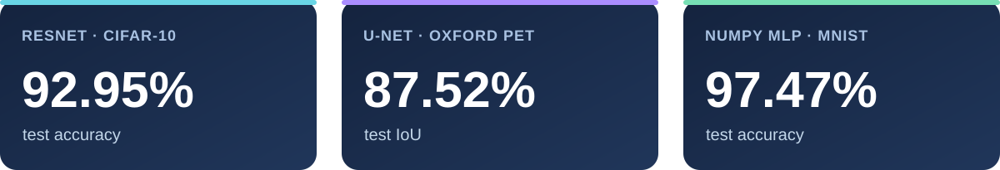

  

  <strong>Hi, I'm Feihang (Skyler).</strong> I study how vision models work by implementing them, running controlled experiments, and examining their results.

## 🎓 Education

| University | Major | Academic record |
| :--- | :--- | :--- |
| **Nanjing University** · Sep 2025–present | Intelligent Science and Technology · undergraduate | **GPA 4.43 / 5.00** |

**Selected coursework:** Fundamentals of C Programming (100/100) · Introduction to Artificial Intelligence (93/100) · Advanced Programming (91/100) · Matrix Computation and Optimization (89/100)

**Current interests:** Computer vision, image classification, semantic segmentation, and deep learning optimization.

## 🧪 Featured projects

  

### 01 · [ResNet on CIFAR-10](https://github.com/skyler-27/resnet-cifar10-reproduction)

**PyTorch · Image classification · Ablation study** 
Implemented ResNet-18 and a matched network without residual connections. Built the training and evaluation pipeline and compared their performance on CIFAR-10: **92.95% vs. 91.39% test accuracy**.

### 02 · [U-Net image segmentation](https://github.com/skyler-27/unet-image-segmentation)

**PyTorch · Semantic segmentation · Loss comparison** 
Implemented U-Net for Oxford-IIIT Pet foreground segmentation and compared BCE, Dice, and combined losses. The combined loss reached **87.52% test IoU** and **93.34% test Dice**.

   
  U-Net predictions alongside ground-truth masks · click to view full size

### 03 · [Deep learning from scratch](https://github.com/skyler-27/deep-learning-from-scratch)

**NumPy · Backpropagation · Optimizer comparison** 
Implemented an MLP and manual backpropagation, checked gradients numerically, and compared SGD, Momentum, and Adam on MNIST. Adam reached **97.47% test accuracy**. [View the validation curves](https://github.com/skyler-27/deep-learning-from-scratch/blob/main/results/optimizer_comparison.png).

## 🛠️ Technical toolkit

| Programming | Machine learning | Development |
| :--- | :--- | :--- |
| C · C++ · Python | PyTorch · NumPy | Git · Jupyter · VS Code · PyCharm |

## ✉️ Contact

**Email:** [cskyler2727@gmail.com](mailto:cskyler2727@gmail.com) &nbsp;·&nbsp; **QQ:** 2984341625 &nbsp;·&nbsp; **WeChat:** chenfh1027
